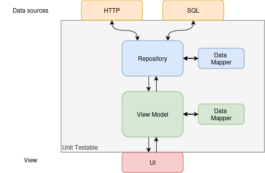

# An Android Sample App
## the Pet Shop App

( **...work in progress...** )

This app allows me to prototype, test language, framework or CI features, explore new ideas, open
discussions and self-reflection about patterns.

**This readme is the documentation for it**

## The sample

It's a pet-store shop app inspired by the Swagger example https://petstore.swagger.io/

The UI is mostly a plan material design, I would be happy to implement a nice custom design system
in the sample (like I've done before times in prod), but I'm not a designer, I won´t pretend to be
one here.

## Architecture

It all starts with a pretty standard unidirectional data flow (UDF) architecture.

- Data sources area separated into services
- Repositories manage different data sources and provide domain data to the UI
- ViewModels implements the logic by managing the UI state and evens
- View draw the state to the screen without question its origin

## Gradle modules

- TODO

## Decision Records

In no specific order, here I discuss a few decisions quirks, ideas implemented around the code,
pros/cons of some pattern applied and even further improvements (as I wanted to have a first commit
and publish it and not keep refactoring and making everything absolutely perfect).

Some of this further improvement are added to Github issues.

### Gradle Conventions

Never had used before, just trying something new. Seems interesting, after initial "everything in
red" seems to work fine. It's a
shame [it doesn't seem to handle version catalogs](https://discuss.gradle.org/t/using-version-catalog-plugins-in-convention-plugins/45660).

### ViewModel: when should it load data?

As we can see
from [this post from Sep/2024](https://proandroiddev.com/loading-initial-data-in-launchedeffect-vs-viewmodel-f1747c20ce62)
and [this other post from Aug/2019](https://proandroiddev.com/when-to-load-data-in-viewmodels-ad9616940da7),
the discussion on when to start loading data in a ViewModel is almost as old as the ViewModel
itself.

In this repo I took the canonically accepted solution, but would like to discuss about the "load on
an `init{}` block" option.

The major downside cited about this option is testing, but IMHO that's only a problem when the
ViewModel is not structured with a testability in mind. Also simple techniques such as setting the
right test dispatcher, constructor injection of `CoroutineScope`, usage of `awaitingCancellation()`
makes the "load on an `init{}` block" approach perfectly testable while keeping the implementation
uncomplicated.

### I18n

Every project should start from the first commit fully supporting internationalization using the
appropriate platform methods (XML files on case of Android).
But said, for a sample project used as exploration and showcase I didn't do it. I'll add an issue to
extract the strings.

### Dependency Injection

Each gradle module exposes a function to create a `Koin` module and they all get called during app
start. The modules are extremely lightweight and all the object construction are done lazily by the
Koin framework.

This project is too small to worry about scoping. So just added services and repositories as
`singletons` and view models as `viewModels`

I never used Hilt before, maybe I should create a parallel implementation with it just to try out
and compare.

### Network service

The service is feature complete for what it must do, but without a real REST API to access, I
created a barebones API designed mostly to simplify the the logic from mock engine (e.g. pagination
based on index). It works okay for a simple sample.

There's an upcoming FOSS generator from swagger yml to ktor client and server and it would be nice
to use it here. The pattern applied is similar to the service, it should be easy to replace later.

### Database service, Repository Flow, Items ordering and filtering

Any real product like a shop would have items ordering and filtering, something like "order by best
match" and "show only dogs". I was missing some ordering from the backend so I added the `priority`
field to the network responses and feed them into the database entities to mock that
behavior, but those mock data was created using `Random.nextFloat()`.

On a real/bigger project a discussion would be nice to weight some pros/cons related to
re-ordering/filtering the items via SQL statements or via operations on the `Flow<List>` in the
repository layer. At the first commit we have a less than ideal scenario with a mixed approach.

An interesting idea also to explore would be
to [add `@RawQuery` into the mix](https://developer.android.com/reference/androidx/room/RawQuery),
this of course would require to pass and map data back and forward through the layers of UDF to keep
the clean separation, and also add id to the performance comparison tests proposed above, keeping in
mind this extract from the docs:

> If you know the query at compile time, you should always prefer Query since it validates the
> query at compile time and also generates more efficient code

### Data invalidation and refresh

As it was said [by smart people again and again](https://martinfowler.com/bliki/TwoHardThings.html)

> There are 2 hard problems in computer science: cache invalidation, naming things, and off-by-1
> errors

Hence, it's out of scope for this sample app.

### Pet Repository

The project started as a single `PetRepository`, but as the code and tests progressed, it became
obvious a clear separation between loading and querying the data. Hence, the split repos with
smaller responsibilities and easier testability.

### ViewModel CoroutineScope

Lately I realized that in current Android project, the view model object doesn't need to extend
from `androidx.lifecycle.ViewModel`, it can be any object that receives a `CoroutineScope` (and a
simple wrapper with set/get when `SavedStateHandle` is needed).

The original `ViewModel` required to extend that class to use the `onCleared()` method to unregister
listeners from database, location or similar. But with Kotlin Flows and Coroutines, that requirement
is basically void.

On this sample, I still coded them as the usual way, but already use constructor injection for the
scope to facilitate test and distance it a bit from the framework.

### Mapper

When mapping domain to UI objects, some details of it might get overly complex or extend to
functionalities that would be shared to other pieces of UI. A good example of it is the conversion
of a kotlin `Instant` to a friendly UI representation.

In such a case, a good approach clean approach is to extract the special parts to its own mapper and
pass it to the constructor. That can be seen here between `RelativeAgeMapper` and `StoreListMapper`.
By using constructor to pass the relative age mapper, testing of the store list mapper stays
unbothered by its complexity. Easier testing and improved re-usability.
